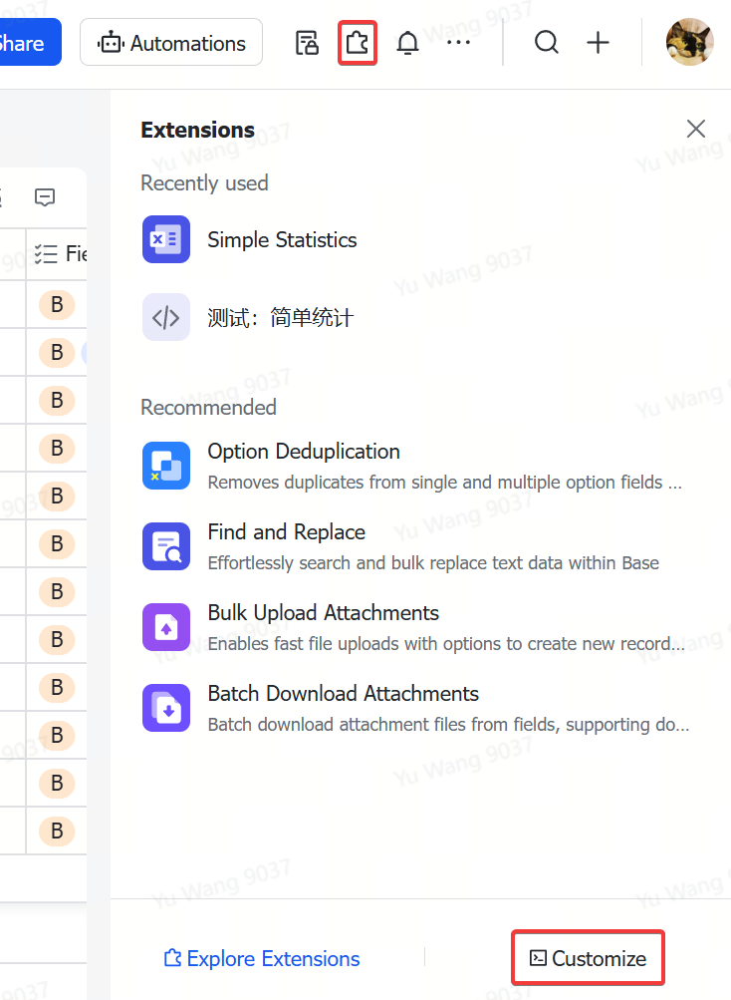
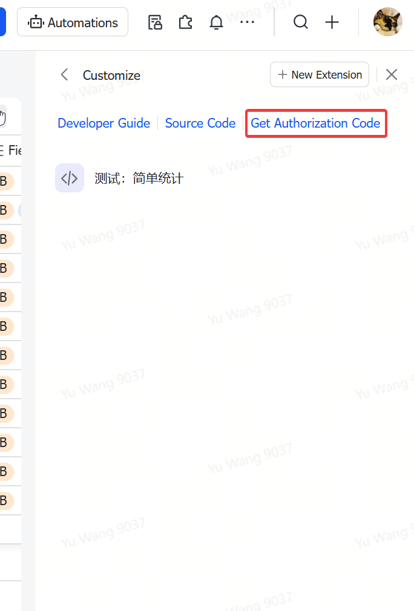

# python-bitable
A Python package to operate with Feishu/Lark bitable

## Install
```
pip install bitable
```

## Usage

### Quick Start

```python
from bitable import Table

table = Table(BASE_ID, BASE_TOKEN, 'TABLE_NAME')

# select records
records = table.select() # select all records
records = table.select({'field_name1': 'value1', 'field_name2': 'value2'}) # select with conditions
records = table.select(Greater('FieldValue', 90))
records = table.select(Or(Greater('FieldValue', 90), And({'FieldSingle': 'A'}, Contain('FieldText', 'text_value')))) # select with complex conditions

# insert records
table.insert({'field_name1': 'value1', 'field_name2': 'value2'}) # insert a record
table.insert([{'field_name1': 'value1', 'field_name2': 'value2'}, {'field_name1': 'value3', 'field_name2': 'value4'}]) # insert multiple records

# update records
table.update({'FieldMultiple': ['B', 'A'], 'FieldDate':'2024-12-21'}, where={'FieldText': 'text_value'}) # update records with where conditions
result = table.select({'FieldText': 'HelloTestUpdate'})[0]
result['FieldText'] = 'new_value'
table.update(result) # update records with record object

# delete records
self.table.delete(where={'FieldText': 'HelloDelete'}) # with where condition
result = table.select({'FieldText': 'HelloTestUpdate'})[0]
self.table.delete(results) # with selected object

```

### Load a table

```python
from bitable import Table

table = Table(BASE_ID, BASE_TOKEN, 'TABLE_NAME')
```

BASE_ID can be found at the bitable's URL after 'base/'  


BASE_TOKEN can be found following these steps:

1. click the "Base extensions" icon on the top right:
2. click "Customize" on the bottom right


3. click "Get Authorization Code"


### Select Records

select all records with just `select()`:

```python
records = table.select()
```

every record is a dict of field name => value. With '_id' key for the record id additionally.

simple conditions like `x==y` can be passed in as a dict:

```python
records = table.select({'field_name1': 'value1', 'field_name2': 'value2'})  
```

use operators to construct complex conditions:

```python
records = table.select(Greater('FieldValue', 90))
records = table.select(Or(Greater('FieldValue', 90), And({'FieldSingle': 'A'}, Contain('FieldText', 'text_value'))))
```

list of operators:

- Equal: "==" operator
- Not: "!=" operator
- Contain: if a string field contains a substring, or a multiple-select field contains an element
- NotContain
- Empty
- NotEmpty
- Greater: ">" operator
- GreaterEqual ">=" operator
- Less
- LessEqual

for date fields, use 'YYYY-mm-dd' format, or one of the following:
`Today()`, `Yesterday()`, `Tomorrow()`, `CurrentWeek()`, `LastWeek()`, `CurrentMonth()`, `LastMonth()`, `Past7Days()`, `Next7Days()`, `Past30Days()`, `Next30Days()`

### Insert Records

insert a record with `insert()`:

```python
table.insert({'field_name1': 'value1', 'field_name2': 'value2'})
```

insert multiple records with a list:

```python
table.insert([{'field_name1': 'value1', 'field_name2': 'value2'}, {'field_name1': 'value3', 'field_name2': 'value4'}])
```

### Update Records

if `record` is a record dict selected from the table, you can change its content, and update it with `update()`:

(in fact, it uses '_id' key to locate the record)

```python
table.update(record)
```

you can also update records with `where` conditions:

```python
table.update({'field_name1': 'new_value1', 'field_name2':'new_value2'}, where={'condition_field_name': 'text_value'})
```

### Delete Records

delete a record selected from the table with `delete()`:

(similar to `update()`, it uses '_id' key to locate which record to delete)

```python
table.delete(record)
```

batch delete records with `where` conditions:

```python
table.delete(where={'field_name': 'field_value'})
```